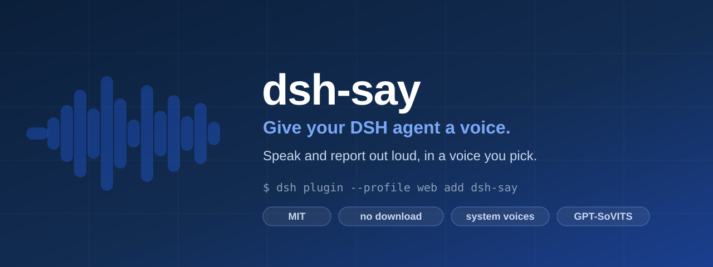

<div align="center">



# dsh-voice

**给你的 DSH 智能体一副嗓子 · 用它喜欢的声音开口说话、汇报内容**

[](https://github.com/fangqian616/dsh-voice/actions/workflows/tests.yml)
[](LICENSE)


[**三分钟上手**](#-三分钟上手) &nbsp;·&nbsp;
[工具](#-工具) &nbsp;·&nbsp;
[配置](#-配置) &nbsp;·&nbsp;
[排错](#-排错) &nbsp;·&nbsp;
[English](#english)

</div>

---

## ⚡ 三分钟上手

> **不需要下载任何东西。** 默认走你操作系统自带的语音 —— 不用 Python、不用显卡、不用账号。

### 1 · 装插件

```sh
dsh plugin --profile web add dsh-say
```

**然后重启 profile** —— 这一步必须由你做，命令行没法替你重启你正开着的会话。

装完就结束。这条命令会把包装好、登记进 profile、并自动应用本包自带的组合层，`tts_*` 工具在重启后出现。

> [!IMPORTANT]
> **仓库叫 `dsh-voice`，npm 包叫 `dsh-say`。** npm 上的 `dsh-voice` 是**另一个人的项目**
> （另一个语音插件，同样是 dsh bundle）—— 装它不会报错，但你会得到一个完全不同的东西。
> 请按上面的包名装。

<details>
<summary><b>从源码装 / 用 git 地址（git 来源首次需要放行构建）</b></summary>

<br>

```sh
git clone https://github.com/fangqian616/dsh-voice
dsh plugin --profile web add "file:E:/path/to/dsh-voice"    # 或用 git 地址：
dsh plugin --profile web add github:fangqian616/dsh-voice
```

git 来源的插件靠 `prepare` 脚本构建，pnpm 默认拦着。`dsh plugin` 会直接打印出要放行的那个键 —— 把它加到 profile 目录的 `pnpm-workspace.yaml` 的 `allowBuilds` 下，再重跑一次即可。

本地 `file:` 路径要用**绝对路径**：pnpm 的工作目录是 profile 目录，相对路径 `.` 会指到 profile 自己。

</details>

<details>
<summary><b>它在 profile 里动什么</b></summary>

<br>

profile 根目录的 `cordis.yml` 是空的，它自己写着不要改它。真正的用户层是 `cordis.patch.yml`，**但这里也不用你手写** —— 本包声明了：

```json
"dsh": { "bundle": { "patch": "./cordis.patch.yml" } }
```

`dsh plugin add` 识别到这个声明后，会把它列进 profile 的 `dsh.profile.bundles` 层栈，并在启动时套用包内那一行：

```yaml
- insert:
    - id: say
      name: dsh-say
```

这是 dsh 插件的标准打包方式，所以升级、卸载、`dsh plugin list` 都能正常跟踪。

</details>

> 如果智能体已经能读到仓库，直接说一句 **"装上这个语音插件"** 就行。它会用 `voice-setup` skill 走完这一步，并且在没重启之前不会谎称装好了。

### 2 · 让它说话

对智能体说：

> 把"你好，我现在会说话了"念出来

它会调用 `tts_speak`，声音从音响里出来。**安装到此结束。**

### 3 · 确认后端状态

> 跑一下 `tts_engines`

```
selected: builtin (configured: auto)
built-in: available, 3 voice(s)
gpt-sovits: unavailable — no GPT-SoVITS checkout found
voice packs: 0 in ~/.dsh/voice-packs
```

**没声音时先跑这个** —— 它会指出确切原因。

### 4 · 想要角色声线（可选）

装之前先读 [`voice/NOTICE.txt`](voice/NOTICE.txt)（素材来源说明，不是许可证）。

本仓库自带一条可以直接装的声线，参考音也一并附带：

```sh
node scripts/install-voice.mjs
```

**一条命令**：自动取权重、自动找你的 GPT-SoVITS、自动放到位并登记。不用手动下载，也不用自己找文件夹。

如果 GPT-SoVITS 不在默认位置：

```sh
node scripts/install-voice.mjs --engine "D:/GPT-SoVITS"
```

---

## 🛠 工具

| 工具 | 作用 |
|:--|:--|
| `tts_speak` | 短句直接念 |
| **`tts_report`** | **长汇报：先压缩再念**，避免把整篇念完 |
| `tts_engines` | 诊断后端 + 返回当前人设 |
| `tts_voices` | 列出或登记声线包 |
| `tts_config` | 读改设置，不用碰配置文件 |

### 为什么汇报要先压缩

中文语音实测约 **5 字/秒** —— 一份 500 字的汇报整篇念完要 **100 秒**，比读它还慢，用户会直接关掉声音。

`tts_report` 会先把长报告压成短稿再朗读，并返回它**实际念出来的文本**，方便确认没漏关键信息：

| | 字数 | 约合时长 |
|:--|--:|--:|
| 原文 | 500 | 100 秒 |
| 朗读 | 120 | 24 秒 |

压缩是**本地句序排序**，零额外模型调用。要更多细节就调大 `budget`。

---

## ⚙️ 配置

**你不用手改配置文件。** 插件自己维护一份设置，存在你家目录：

```
~/.dsh/voice/config.json
```

首次加载时它会问你三个问题（声线、人设、要不要自动播报），答案直接写进去。之后想改，**跟智能体说就行**：

> 把语速调到 1.2
> 默认声线换成 silver-wolf
> 看看现在的配置

<details>
<summary><b>可用的键</b></summary>

<br>

| 键 | 作用 |
|:--|:--|
| `engine` | `auto` \| `builtin` \| `gpt-sovits` |
| `defaultVoice` / `defaultVoiceBuiltin` | 默认声线包 / 默认系统语音 |
| `speed` | 语速 0.5–2.0 |
| `textLang` | 朗读文本的语言 |
| `reportBudget` | 汇报保留字数 |
| `keepAudio` | 是否保留 wav |
| `engines.gptSovits.engineRoot` | GPT-SoVITS 目录 |
| `engines.gptSovits.serverUrl` | 或指向已运行的 API |

**优先级**：用户文件 > 组合里的 `config` > 内置默认。部署方仍可在组合里固定值，但**用户自己设的赢**。

</details>

---

## 🎚 两种后端

| | 系统语音（默认） | GPT-SoVITS（可选） |
|:--|:--|:--|
| 安装成本 | **零** | 约 2 GB 起 |
| 音质 | 清晰但机械 | 角色声线、零样本克隆 |
| 英文 | 原生分语言 | 声明语言即可 |
| 依赖 | Windows SAPI，**连 ffmpeg 都不需要** | 本地检出或远端 API |

`engine: auto` 会在你登记声线包之后**自动切到 GPT-SoVITS**，不用改配置。

---

## 🔧 排错

<details>
<summary><b>常见问题</b></summary>

<br>

| 现象 | 原因 |
|:--|:--|
| 没声音但 `played: true` | 输出设备选错或静音 |
| `System.Speech is unavailable` | 系统没装 SAPI 语音，或 PowerShell 被策略拦截 |
| `no GPT-SoVITS checkout found` | 设 `engines.gptSovits.engineRoot` |
| `voice pack ... is incomplete` | 声线包缺 `ref.wav`、`ref.txt` 或权重 |
| GPT-SoVITS 太慢 | 把 `sampleSteps` 从 32 降到 16 |

先跑 `tts_engines` —— 它会给出后端不可用的确切原因。

</details>

<details>
<summary><b>环境要求</b></summary>

<br>

- **内置引擎**：Windows（SAPI）。目前仅此平台；macOS / Linux 后端欢迎 PR
- **GPT-SoVITS 引擎**：Windows 或 Linux，需一个带 Python 环境的检出。显卡可选
- Node 20+

</details>

---

## 📦 开发

```sh
git clone https://github.com/fangqian616/dsh-voice && cd dsh-voice
npm test              # 7 个测试，不出声
npm run test:audible  # 真实播放检查
```

无构建步骤，纯 ESM JavaScript。改代码必须让 `npm test` 通过 —— 详见 [CONTRIBUTING.md](CONTRIBUTING.md)。

**仓库不含任何模型权重、声音数据或音频。** 参考音和声线定义在仓库里，权重单独取（单个文件 148 MB，超过 GitHub 的 100 MB 上限）。

---

<a id="english"></a>

## English

**Give your DSH agent a voice — speak and report in one you like.**

The default backend is whatever speech voices your operating system already has, so step 1 and 2 need no download: no Python, no GPU, no account.

```sh
dsh plugin --profile web add dsh-say
```

Restart the profile, then ask the agent to *"say hello out loud"*. The command installs the package, registers it in the profile, and applies the bundle layer this package ships; the `tts_*` tools appear after the restart.

> [!IMPORTANT]
> **The repository is `dsh-voice`; the npm package is `dsh-say`.** The name `dsh-voice` on npm belongs to an unrelated project — another voice plugin, also a dsh bundle — so installing that one succeeds and gives you something else entirely. Use the package name above.

| Tool | Purpose |
|:--|:--|
| `tts_speak` | Speak a short line |
| `tts_report` | **Compress a long report, then speak it** |
| `tts_engines` | Diagnose backends, return the active persona |
| `tts_voices` | List or register voice packs |
| `tts_config` | Read and change settings without editing files |

**Why reports are compressed:** Chinese speech measures about 5 characters per second, so a 500-character report read in full takes 100 seconds — slower than reading it.

**Configuration lives in `~/.dsh/voice/config.json`**, written by first-run onboarding and editable through `tts_config`. Precedence is user file > composition > default.

**Engines:** the built-in one drives SAPI on Windows and needs no external media program; GPT-SoVITS is optional and switches in automatically once a voice pack exists.

Read [`voice/NOTICE.txt`](voice/NOTICE.txt) before installing the bundled character voice — a materials notice, not a license.

---

<div align="center">

**MIT** · 不附带任何模型权重、声音数据或音频

<sub>代码 MIT · 角色、声音与参考音的权利归其所有者 · Code is MIT; character, voice, and reference-audio rights belong to their owners</sub>

</div>
